# 基于springboot的厨艺交流平台

---
### 👉作者QQ ：1556708905 微信：zheng0123Long (支持定制修改、部署调试、定制毕设)

### 👉接网站建设、小程序、H5、APP、各种系统等

---

#### 介绍

我开发的基于SpringBoot的厨艺交流平台旨在为广大厨艺爱好者提供一个交流和分享的平台。该平台涵盖了菜谱分享、食材购买、健康文章阅读等功能，满足用户在学习、分享、购买、记录等方面的需求。平台拥有管理员和用户两种角色，各自有不同的功能模块，通过权限管理确保操作的安全和便捷性。

#### 技术栈

后端技术栈：Springboot+Mysql+Maven

前端技术栈：Vue+Html+Css+Javascript+ElementUI

开发工具：Idea+Vscode+Navicate

#### 系统功能介绍

管理员角色功能模块：  
个人中心：管理员可以管理个人信息，修改密码等。  
食材分类管理：管理和维护不同类别的食材信息。  
用户管理：管理平台用户的基本信息和权限。  
菜谱分类管理：管理和维护菜谱的分类，方便用户查找。  
菜谱信息管理：发布、编辑和删除菜谱信息，包括菜谱的详细步骤和图片。  
食材信息管理：录入和管理食材的详细信息。  
商品分类管理：管理商品的分类，便于用户查找和购买。  
商品信息管理：发布、编辑和删除商品信息，包括商品的价格和库存等。  
美食日志管理：管理用户发布的美食日志，审核和发布用户的日志内容。  
健康文章管理：发布和管理健康相关的文章，为用户提供健康饮食建议。  
系统管理：管理平台的整体设置和维护。  
订单管理：管理用户的订单信息，处理订单的支付和发货等事宜。  

用户角色功能模块：    
菜谱信息：浏览和查找各种菜谱，学习和分享烹饪技巧。  
食材信息：查找和购买所需的食材，了解食材的详细信息。  
商品信息：浏览和购买各类厨艺相关商品。  
美食日志：记录和分享自己的美食制作过程和心得。  
健康文章：阅读平台发布的健康饮食文章，获取健康知识。  
个人中心：用户可以管理个人信息，修改密码等。  
后台管理：  
美食日志管理：用户可以管理自己发布的美食日志。  
我的收藏管理：管理用户收藏的菜谱、食材和商品。  
订单管理：查看和管理自己的订单信息，包括订单状态和物流信息。  

#### 系统作用

促进厨艺交流：平台为厨艺爱好者提供了一个分享和交流的平台，用户可以发布和学习菜谱，记录和分享美食日志。  
便捷食材购买：用户可以通过平台购买所需的食材和厨艺相关商品，提供了便利的购物渠道。  
健康饮食指导：平台提供了大量健康饮食相关的文章，帮助用户了解健康饮食知识，养成良好的饮食习惯。  
系统化管理：管理员可以系统化地管理用户、菜谱、食材、商品等信息，提高了平台的管理效  

#### 系统功能截图

代码结构

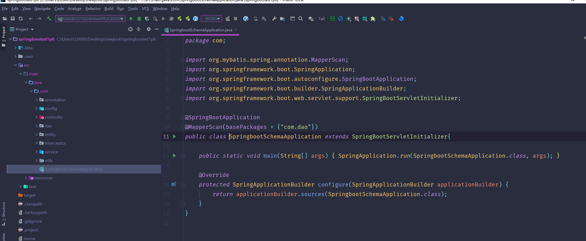

数据库表

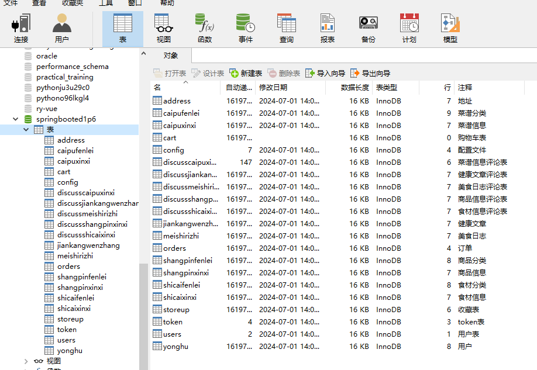

登录

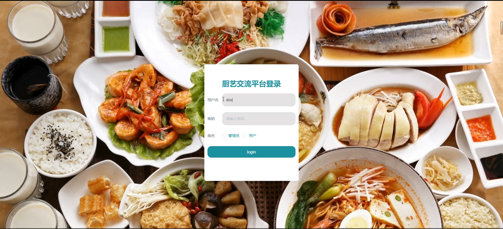

用户管理

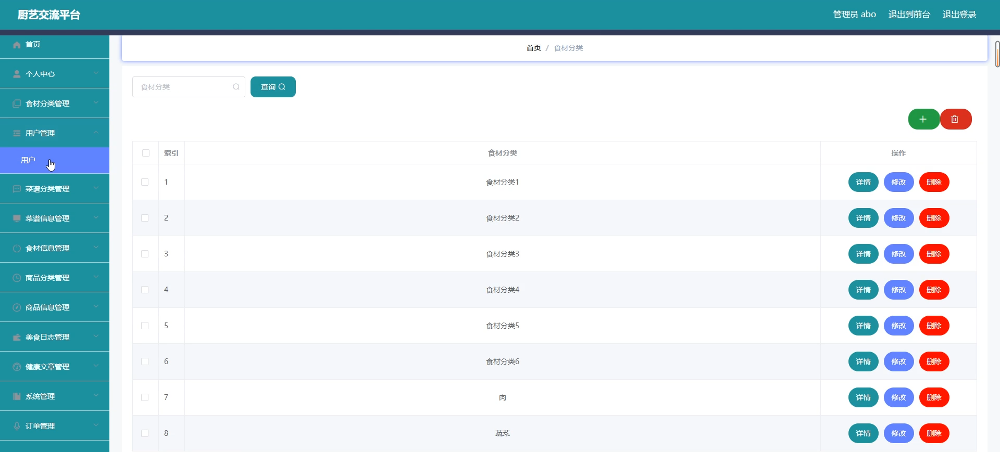

菜谱分类管理

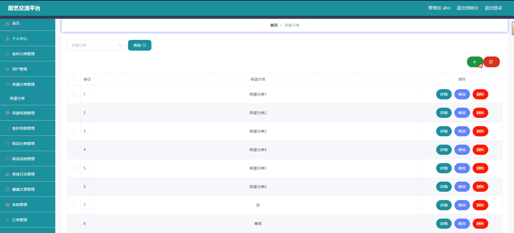

菜谱信息管理

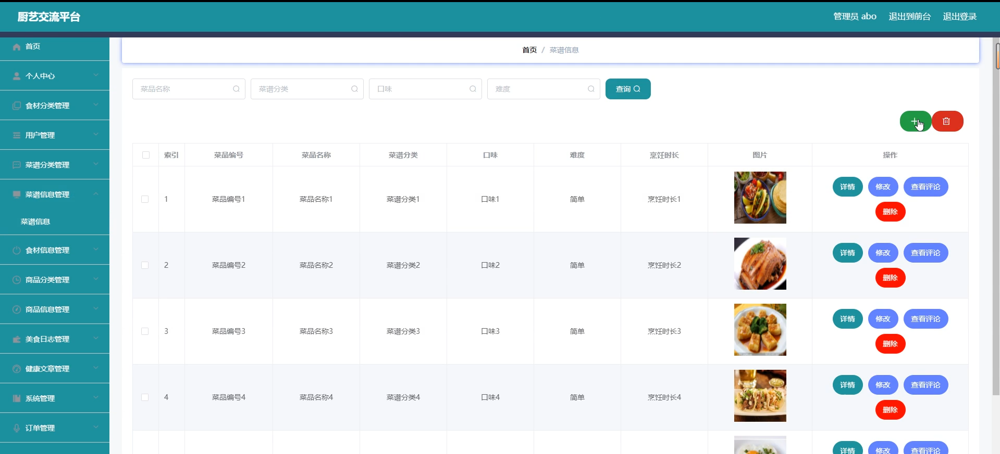

食材信息管理

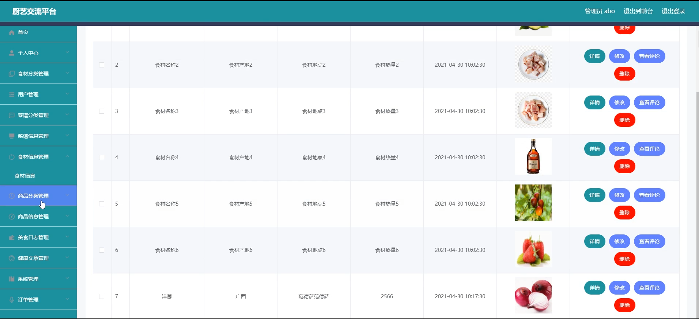

商品信息管理

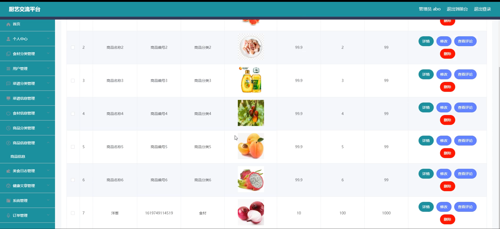

前台页面首页

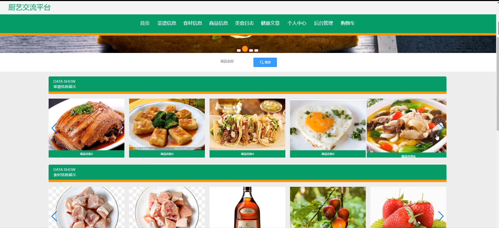

个人中心

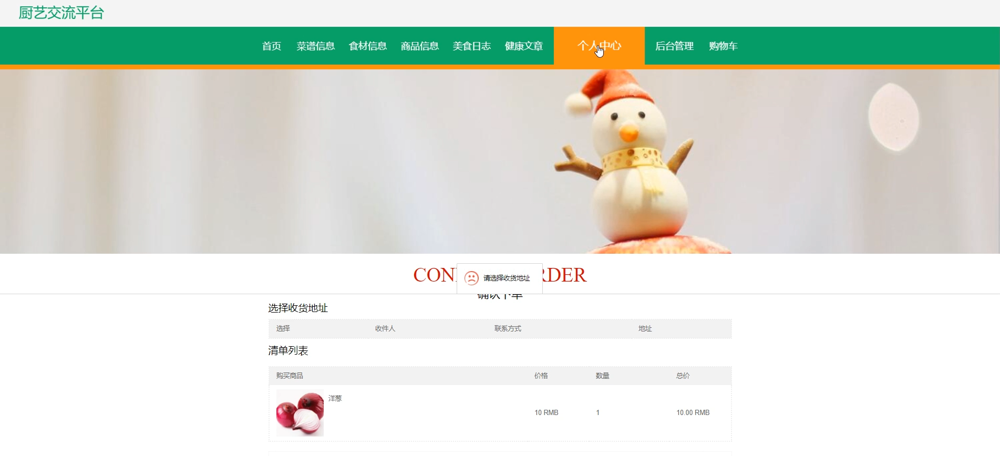

购物车

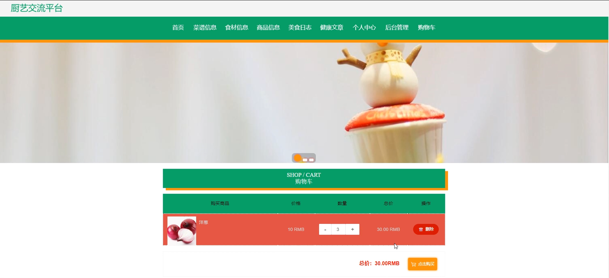

美食日志

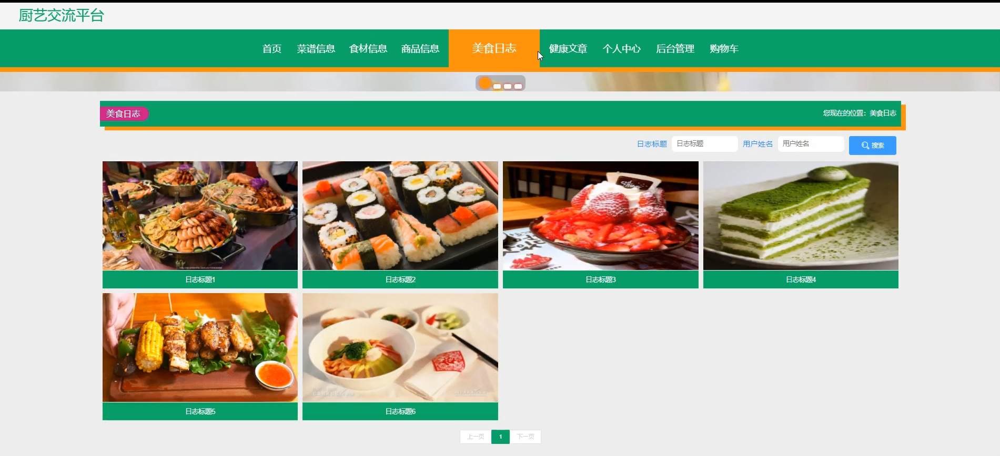

用户端后台管理

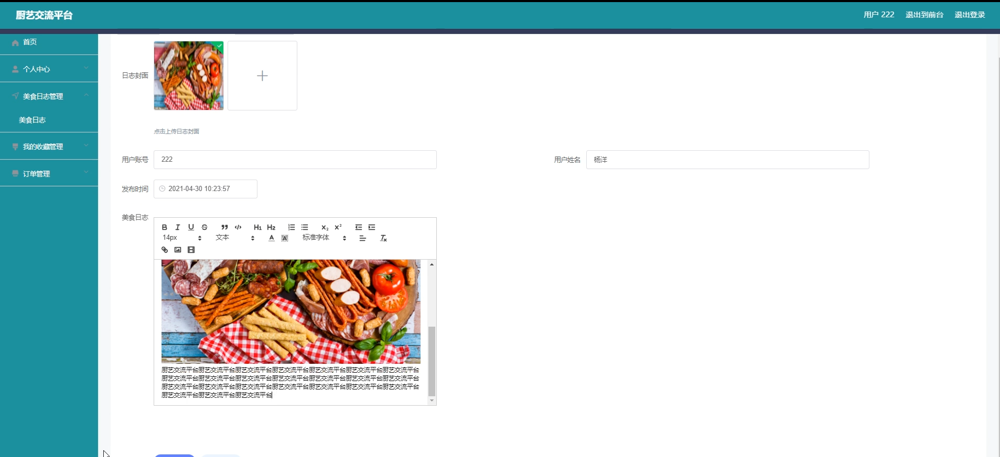

#### 总结

基于SpringBoot的厨艺交流平台旨在为厨艺爱好者提供一个综合性的交流和分享平台。通过细致的功能模块设计，满足用户在学习、分享、购买等方面的需求。同时，通过管理员的有效管理，确保平台的内容质量和用户体验。该平台不仅促进了用户间的厨艺交流，也为用户提供了便捷的食材和商品购买渠道，以及健康的饮食指导。

#### 使用说明

创建数据库，执行数据库脚本 修改jdbc数据库连接参数 下载安装maven依赖jar 启动idea中的springboot项目

后台地址：http://localhost:8080/springbooted1p6/admin/dist/index.html

管理员  abo 密码 abo

前台地址：http://localhost:8080/springbooted1p6/front/index.html

